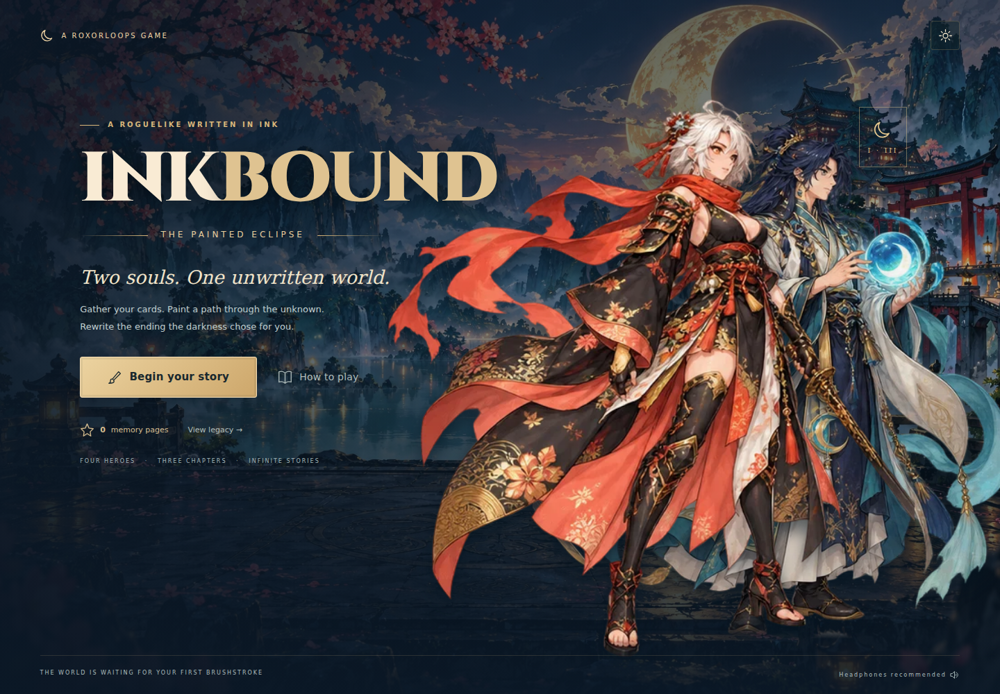

# INKBOUND · The Painted Eclipse



An original, self-contained anime roguelike deckbuilder inspired by Roguebook's shared-deck and painted-map systems. This is a complete three-chapter browser campaign, not a reproduction of Roguebook's proprietary card catalogue, story, art, balance, or UI.

## Play

Serve the repository over HTTP and open `/inkbound/`. No runtime dependencies, external assets, API keys, account, or build step are required. The repository's normal Cloudflare build includes this directory.

```sh
python3 -m http.server 8000
# http://localhost:8000/inkbound/
```

Choose two of four heroes, paint the hex atlas, collect cards and relics, and defeat three chapter guardians. Each chapter requires three victories before its boss. Optional exploration yields shops, camps, narrative choices, gold, gems, and ink. A revealed road guarantees access to the mandatory encounters without requiring more ink.

### Implemented content and mechanics

- Four distinct heroes and all six pair combinations; personal health, passives, front/support formation, and one free swap per turn.
- 60 cards (15 per hero), 12 relics, six gem types, two sockets per card, six deck-size talents, and camp upgrades.
- Three procedurally populated 63-hex chapters, brush-radius and targeted-ink discovery, path obstruction by encounters, and reusable merchants with persistent stock.
- Six enemy archetypes and three chapter bosses with visible action cycles, chapter scaling, and 20 unlockable Eclipse difficulty levels.
- Shared energy, draw/discard/exhaust piles, multi-hit and area attacks, poison, bleed, weak, vulnerable, power, block, healing, thorns, summons, and card-based formation changes.
- Card rewards, shops, four narrative events, resting, upgrading, relics, gems, boss rewards, chapter transitions, victory and defeat, permanent memory-page upgrades.
- Original generated character, enemy, card and environment art; idle breathing, attacks, spell glow, hit reactions, particles, damage numbers, and synthesized ambient music/SFX.
- Desktop, portrait and landscape touch layouts, keyboard controls, reduced motion, independent music/effects controls, a field guide, and automatically saved runs and settings.

## Controls

Tap a painted map tile to travel. Brush reveals a radius of two; moon ink reveals a chosen unrevealed tile within four hexes plus its neighbors. In combat, select a card and then an enemy when a target is required. Skills without an enemy target resolve immediately. Cards scroll horizontally on small screens.

Keyboard: `1–9` select card; `E` end turn; `S` switch heroes; `B` brush; `D` deck; `Escape` cancel/close/pause. Map nodes support keyboard focus and Enter. Modal keyboard focus is contained.

## Saves

Local-only, versioned keys: `inkbound.run.v1`, `inkbound.meta.v1`, `inkbound.settings.v1`. Saves do not access or change other games. Clearing browser data removes local progress. A run is credited to the persistent page balance once only. Abandoning grants the pages already earned.

## Verification

```sh
npm run test:inkbound
node inkbound/tests/balance.mjs
# Browser integration (Playwright installed):
CHROMIUM_PATH=/path/to/chromium node inkbound/tests/ui.cjs
npm run check
```

The balance script is a deterministic combat stress scenario: it deliberately exposes optional encounters and gives its agent full information. Its success count is not a measured human win rate. The browser suite uses real UI clicks for the first combat/reward/reload flow and shop/gem interactions, then saved fixtures for viewport coverage. Screenshots default to a sibling `inkbound-qa` folder; set `INKBOUND_SCREENSHOTS` to choose another location.

## Files

- `engine.mjs`: deterministic, DOM-free game rules and serialization.
- `data.mjs`: heroes, cards, relics, gems, talents, enemies, chapters and events.
- `app.mjs`: interface, interactions, save lifecycle and accessibility.
- `style.css`: responsive presentation and animations.
- `audio.mjs`: synthesized audio, no sampled recordings.
- `assets/`: local optimized WebP atlases and title font.
- `ART_DIRECTION.md`: art provenance and generation briefs.

## Scope

This is an original single-player browser game. It has no multiplayer, cloud saves, store platform integration, controller mapping, or localization. Long-term human balance testing and a larger encounter/card catalogue remain future expansion work. Character animation uses illustrated cutouts with procedural motion rather than frame-by-frame skeletal animation.
